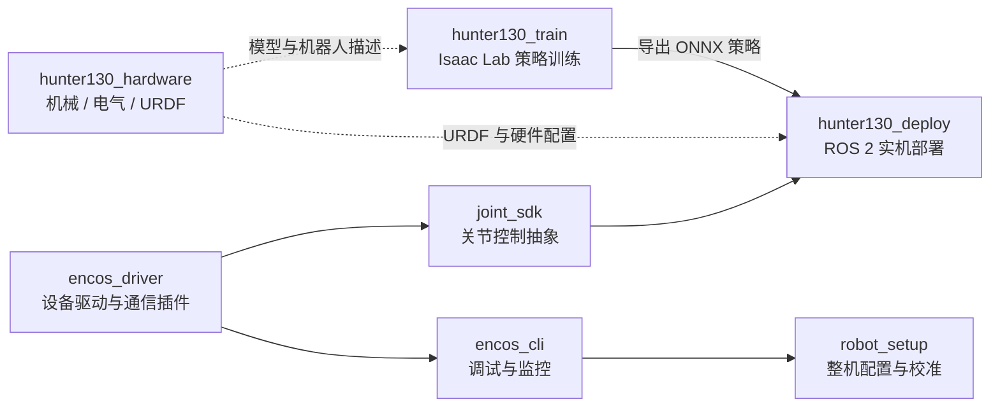

# Hunter 130 开源项目合集

[](https://github.com/EncosTech)
[](https://github.com/EncosTech/hunter130_hardware)
[](https://github.com/EncosTech/hunter130_deploy)

本仓库是 [EncosTech](https://github.com/EncosTech) 的开源项目聚合入口，集中导航 Hunter 130（Hunter V2 / EC H130-V2）人形机器人相关的硬件资料、底层驱动、关节 SDK、调试与校准工具、强化学习训练以及 ROS 2 部署项目。

> 本仓库用于项目索引与整体说明。各组件的源码、版本、构建方法和 Issue 均由对应仓库独立维护。

## 项目全景



## 仓库导航

| 仓库 | 定位 | 主要技术 | 许可证 |
| --- | --- | --- | --- |
| [encos_driver](https://github.com/EncosTech/encos_driver) | Encos 电机、电池和 PMS 的 C++17 驱动库，支持可扩展通信适配器插件 | C++17、CMake、EtherCAT、SocketCAN、WASM | 项目代码主要为 MIT；EtherCAT 插件及第三方组件遵循各自许可 |
| [joint_sdk](https://github.com/EncosTech/joint_sdk) | 基于 `encos_driver` 的关节控制 SDK，提供旋转、连续旋转和双电机耦合关节抽象 | C++17、CMake、TypeScript/WASM | 项目代码 MIT；第三方组件遵循各自许可 |
| [encos_cli](https://github.com/EncosTech/encos_cli) | 面向电机和外围设备的命令行 / TUI 调试、监控、基准测试及轨迹播放工具 | C++17、FTXUI、CMake | MIT |
| [hunter130_hardware](https://github.com/EncosTech/hunter130_hardware) | Hunter V2 的机械模型、电气资料、URDF、网格资源与安装手册 | STEP、Parasolid、URDF、STL | CERN-OHL-S-2.0 |
| [hunter130_train](https://github.com/EncosTech/hunter130_train) | 面向 23 个受控关节的强化学习行走策略训练、回放与 ONNX 导出 | Python、Isaac Lab、PPO、AMP、RSL-RL | BSD-3-Clause |
| [hunter130_deploy](https://github.com/EncosTech/hunter130_deploy) | EC130 实机 ROS 2 控制系统，包含硬件接口、遥控器通信、站立与强化学习行走控制 | ROS 2 Jazzy、ros2_control、C++、ONNX Runtime | GPL-3.0 |
| [robot_setup](https://github.com/EncosTech/robot_setup) | 机器人连接检查、通信验证、电机 ID 设置、关节校准、IMU 检测与整机运动验证工具 | Python、Web UI、`emcli` | 仓库暂未声明统一许可证 |

## 获取全部项目

各组件是相互独立的 Git 仓库。下面的命令会创建一个本地工作区，并将当前公开项目克隆到同一目录：

```bash
mkdir -p EncosTech && cd EncosTech

repos=(
  hunter130_collection
  encos_driver
  joint_sdk
  encos_cli
  hunter130_hardware
  hunter130_train
  hunter130_deploy
  robot_setup
)

for repo in "${repos[@]}"; do
  git clone --recurse-submodules "https://github.com/EncosTech/${repo}.git"
done
```

已经克隆的仓库可用以下命令拉取更新，并同步其 Git 子模块：

```bash
git -C <仓库目录> pull --ff-only
git -C <仓库目录> submodule update --init --recursive
```

不同项目的系统依赖和构建流程并不相同，请进入对应仓库并遵循其 README。典型环境包括 Ubuntu 24.04、ROS 2 Jazzy、CMake/C++17，以及用于训练的 Isaac Sim / Isaac Lab。

## 安全提示

Hunter 130 属于可运动的实体机器人。进行上电、校准、轨迹播放或策略部署前，请确保机器人可靠固定、急停装置有效、运动区域内无人员和障碍物。首次运行新控制器或策略时应限制速度与输出，并由具备资质的人员现场监护。

## 反馈与贡献

- 与具体组件相关的问题，请在相应仓库提交 Issue 或 Pull Request。
- 涉及多个组件的集成问题，可在本聚合仓库中讨论，并附上硬件版本、软件版本、复现步骤和相关日志。
- 提交修改前，请先阅读目标仓库的贡献说明、代码规范及许可证要求。

## 许可证

本合集不改变任何子项目的授权方式。每个仓库及其中的第三方组件可能采用不同许可证；复制、修改、分发或商用前，请以目标仓库内的 `LICENSE`、`COPYING` 和第三方声明为准。

## 相关链接

- [EncosTech GitHub 组织](https://github.com/EncosTech)
- [南京因克斯智能科技有限公司](https://www.encos.cn)
